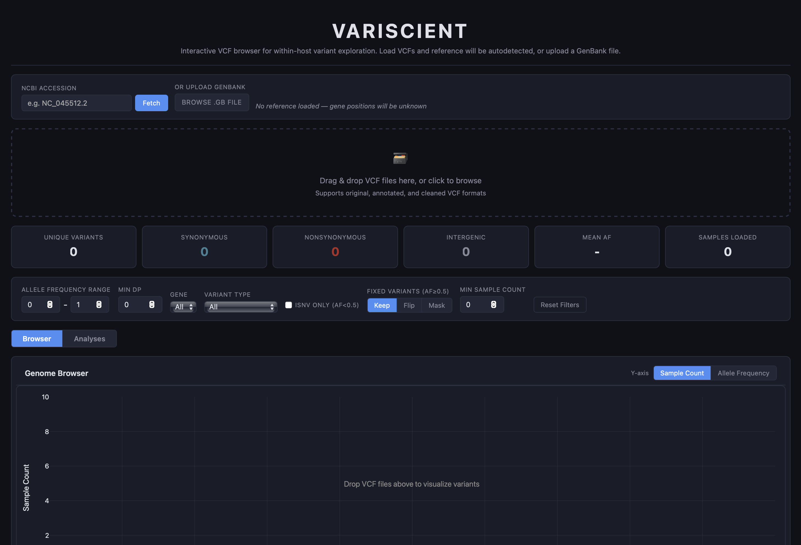

# Variscient

Interactive VCF browser for within-host variant exploration.

**Try it now: [gagekmoreno.github.io/variscient](https://gagekmoreno.github.io/variscient/)**

## Overview

Variscient is a single self-contained HTML application for visualizing and exploring within-host variants across multiple samples. No installation, no server — just open in a browser.

Drop VCF files and the reference genome is autodetected from the CHROM field and fetched from NCBI. Variants are aggregated across samples, plotted on an interactive genome browser, and displayed in a sortable/filterable table.

## Features

- **Drag-and-drop VCF loading** — supports original, annotated, and cleaned VCF formats
- **Automatic reference detection** — extracts the accession from VCF CHROM column and fetches the GenBank record from NCBI
- **Manual reference loading** — enter an NCBI accession or upload a GenBank file
- **De novo annotation** — classifies variants as synonymous/nonsynonymous/intergenic using the reference sequence and codon translation
- **Cross-sample aggregation** — groups identical variants (by POS/REF/ALT) and counts how many samples they appear in
- **Interactive genome plot** — Plotly scatter plot with x = genome position, y = sample count, colored by variant type, with a gene track below
- **Filterable data table** — Tabulator table with per-column header filters, sortable by any column
- **Filters** — allele frequency range, minimum DP, gene, variant type, iSNV-only, PASS-only, minimum sample count
- **Fixed variant handling** — toggle to keep, flip (swap REF/ALT and invert AF), or mask variants with AF >= 0.5
- **Detail view** — click any variant to see per-sample data (AF, DP, filter status, strand bias)
- **Export** — download filtered table as CSV/TSV, download plot as PNG/SVG
- **Analyses tab** — dedicated tab with population genetics and mutational analyses:
  - **Variants Per Sample** — histogram of variant counts per sample with mean and median lines
  - **Site Frequency Spectrum** — allele frequency histogram with 1/f neutral expectation overlay and dynamic shape summary interpretation
  - **Mutational Spectrum** — counts of all 12 single-nucleotide substitution types, colored by starting base
  - **dN/dS** — ratio of nonsynonymous to synonymous substitution rates (Nei-Gojobori method), computed per sample then aggregated as mean with 95% CI. Two modes: Per Gene (bar chart per gene) and Rolling Window (sliding window within each gene at 10–500 nt resolution, plotted across the genome)
  - Each analysis has an independent type filter (All / Syn / Nonsyn / Intergenic) and responds to the main filters
- **Colorblind mode** — toggle to an Okabe-Ito colorblind-safe palette for all plots, badges, and UI elements; preference persists via localStorage

## Usage

1. Open [gagekmoreno.github.io/variscient](https://gagekmoreno.github.io/variscient/)
2. Drop one or more VCF files onto the drop zone
3. The reference will be autodetected and fetched — or enter an accession / upload a GenBank file manually
4. Explore variants using the plot, table, and filters

## Variant Type Colors

| Type | Default | Colorblind Mode |
|------|---------|-----------------|
| Synonymous | Teal | Blue (#0072B2) |
| Nonsynonymous | Burnt red | Vermillion (#D55E00) |
| Intergenic | Gray | Yellow (#F0E442) |

## Colorblind Mode

Click the **Colorblind Mode** button in the top-right corner to switch all colors to an [Okabe-Ito](https://jfly.uni-koeln.de/color/) colorblind-safe palette. This affects variant type colors, gene track colors, mutational spectrum colors, and all analysis plots. The preference is saved in your browser and persists across sessions.

## License

MIT
